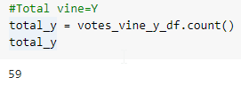
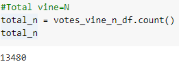
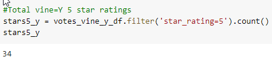
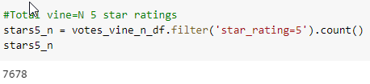
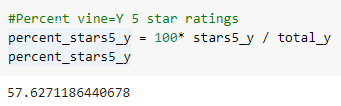
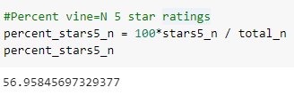

# Overview of the Amazon Vine Analysis

### The purpose of these analyses was to determine of there is a bias for more favorable reviews on Amazon for products reviewed by paid Vine members vs non Vine members. The data were selected from one of 50 datasets of Amazon reviews. The one chosen for this project was reviews of musical instruments. To get experience with AWS the data were first read into a Postgres database connected to an AWS RDS instance. Four tables were loading into the database. The final analysis will determine if there are a greater percentage of 5 star ratings for the paid Vine reviewers vs unpaid reviewers.

 

## Results 

 

-   How many Vine reviews and non-Vine reviews were there?
    
    Vine total = 59

 

 

      Non Vine total = 13,480

 

 

-   How many Vine reviews were 5 stars? How many non-Vine reviews were 5 stars?
    
    Vine 5 star ratings = 34

 

 

      Non Vine 5 star ratings = 7,678

 

 

-   What percentage of Vine reviews were 5 stars? What percentage of non-Vine reviews were 5 stars?
    
    Vine 5 star ratings percentage = 57.63%

 

 

      Non Vine 5 star ratings percentage = 56.96%

 

 

### Summary: The percentage of 5 star ratings is only slightly higher for the paid Vine reviewers. There is less that 1% difference between the groups (57.63% - 56.96 = 0.67%). From the initial overall analyses of the musical instrument ratings on Amazon, it does not look like there is a bias towards higher reviews when people are paid to review products. In order to test the results statistially, I ran a 2 sample t test of proprtions. The resulting p-value was 0.917 which shows there is very strong evidence that there is **no difference** between the percentages for the 2 groups. To further support this it would be a good idea to perform the same anaylses on multiple Amaaon product reviews to see if the lack of bias is true across many products.